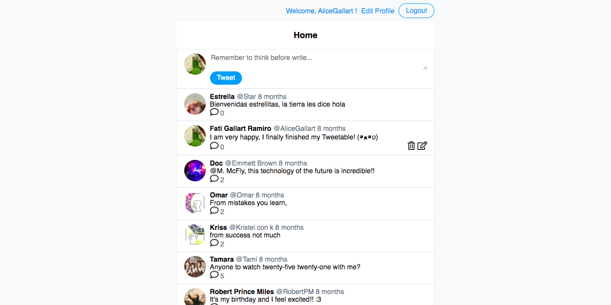
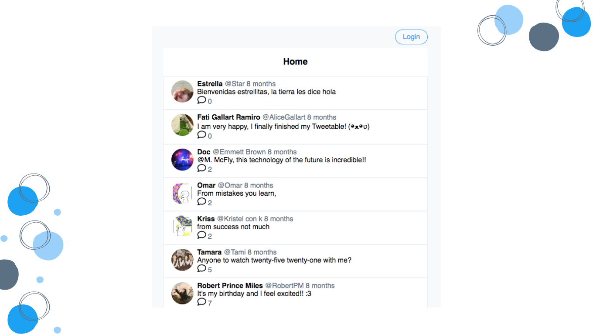
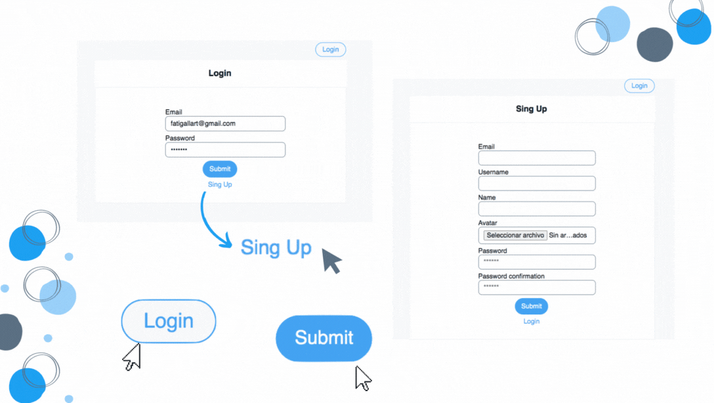
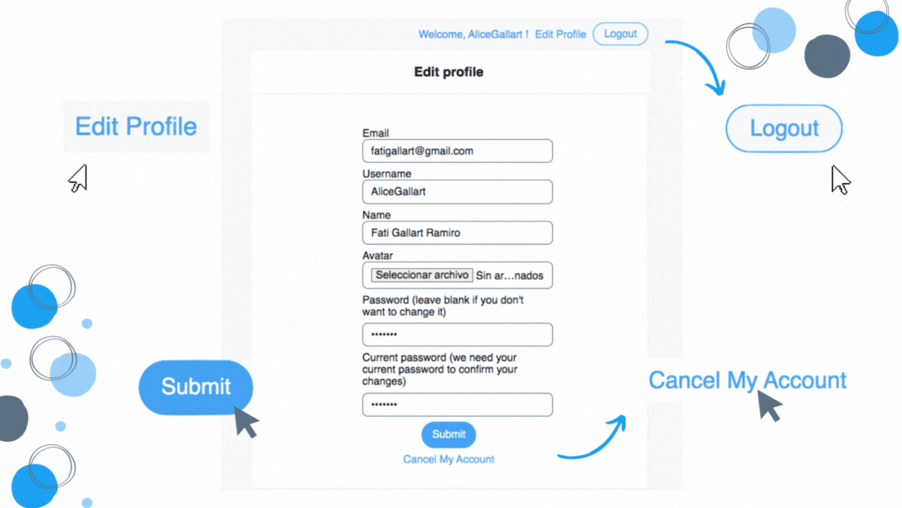
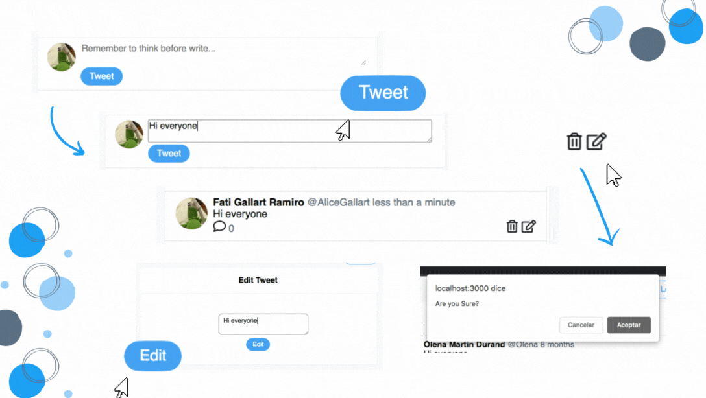
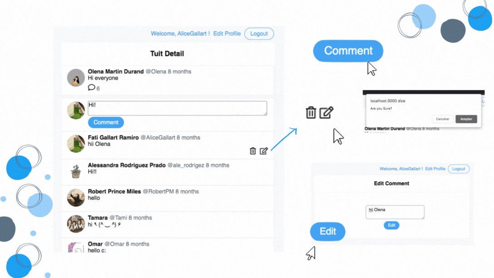

# Tweetable

A simple version of Twitter where the user can create a account, make posts and comments.

## Table of contents

- [Getting Started](#getting-started)
  - [Built with](#built-with)
  - [Prerequisites](#prerequisites)
  - [Installation](#installation)
- [Overview](#overview)
  - [Screenshot](#screenshot)
  - [Links](#links)
- [How to use](#how-to-use)
  - [Home](#home)
  - [User account](#user-account)
  - [Tweets](#tweets)
  - [Commets](#comments)

## Getting Started
### Built with
- Ruby on Rails
- CSS
- PostreSQL

### Prerequisites
- Ruby version: `3.1.0`
- Rails version: `7.0.3.1`

### Installation
Run the following commands to install dependencies:
```
bundle install
```
Running the app
```
rails server
```
To view it open http://localhost:3000

## Overview
### Screenshot


### Links
- Live Site URL: [Tweetable]()

## How to use

### Home
You will see the Tweetable home page where there will only be tweets and comments, in order to post a tweet or comment, you need to login.



### User account
To login, click the "Login" button, this will take you to the Login page, if you don't have an account you can create it, click the button "Sign Up" on this page, this will take you to the Sign Up page.



Also you can edit and delete your profile. In the home page click the "Edit profile" button, this will take you to Edit Profile page, update your information and click "submit" to edit, or click "Cancel my account" to delete.



### Tweets
Now you are on Tweetable. Here you can create, edit and delete permanently tweets.

To create a tweet, write it and click the "Tweet" button.

To edit a tweet, click on it pencil button, this will take you to the Edit page, here update your tweet and click the "Edit" button.

And to delete permanently a tweet, click on it trash button, a window will appear to confirm that you want to delete the tweet.



### Commets
To edit and delete permanently your comments are the same with their respective buttons.

To create a comment, you must enter the tweet, click it comment button to enter, write the comment and click the "Comment" button to post it.

